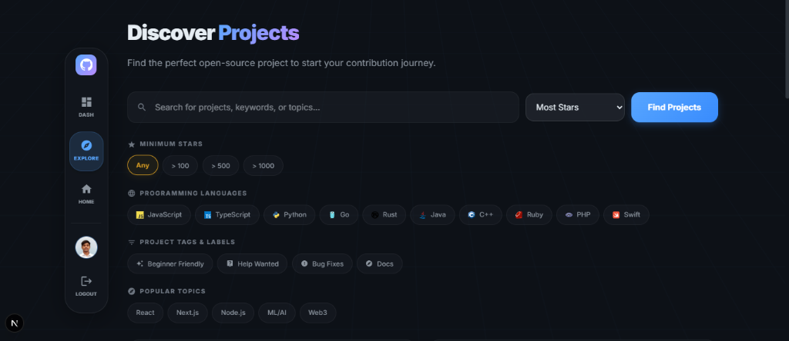

# ContriHub

ContriHub is an open-source platform designed to seamlessly connect developers with beginner-friendly open-source projects. By aggregating repositories based on custom filters and providing an intuitive dashboard, ContriHub simplifies the process of discovering issues, tracking contributions, and building a professional developer profile.

## Preview




## Architecture

The project is structured as a full-stack monorepo, decoupled into a Go-based backend and a React (Next.js) frontend.

- **Frontend**: Next.js (Pages Router), React, Material UI, Tailwind CSS
- **Backend**: Go, Gin Framework, GORM
- **Database**: PostgreSQL
- **Caching & Sessions**: Redis
- **Authentication**: GitHub OAuth

## Features

- **GitHub OAuth Integration**: Secure authentication and session management using GitHub.
- **Dynamic Discovery Engine**: Filter repositories by programming language, labels (e.g., `good-first-issue`), popular topics, and minimum star counts.
- **Developer Profile Dashboard**: Real-time aggregation of GitHub statistics, top languages, and top repositories.
- **Responsive 3D UI**: Premium, dark-themed UI with glassmorphism and animated 3D grid backgrounds.
- **RESTful API**: Scalable Go backend adhering to strict clean architecture principles.

## Prerequisites

- Go 1.21 or higher
- Node.js 18 or higher
- PostgreSQL
- Redis
- Docker (optional, for containerized deployment)

## Installation and Setup

### 1. Clone the Repository

```bash
git clone https://github.com/yourusername/ContriHub.git
cd ContriHub
```

### 2. Backend Setup

```bash
cd backend
go mod tidy
```

Set up your `.env` file in the `backend` directory based on the provided `.env.example`. Ensure you configure your GitHub OAuth credentials, database connection strings, and Redis URI.

Run the backend server:

```bash
go run cmd/main.go
```

The backend API will be available at `http://localhost:8080`.

### 3. Frontend Setup

```bash
cd ../frontend
npm install
```

Set up your `.env.local` file in the `frontend` directory:

```env
NEXT_PUBLIC_API_URL=http://localhost:8080/api/v1
```

Run the frontend development server:

```bash
npm run dev
```

The frontend will be available at `http://localhost:3000`.

## Contributing

We welcome contributions from the community. Please read our contributing guidelines before submitting pull requests.

1. Fork the project.
2. Create your feature branch (`git checkout -b feature/AmazingFeature`).
3. Commit your changes (`git commit -m 'Add some AmazingFeature'`).
4. Push to the branch (`git push origin feature/AmazingFeature`).
5. Open a Pull Request.

## License

This project is licensed under the MIT License. See the LICENSE file for details.
