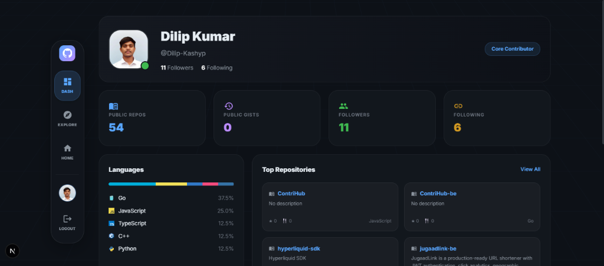

# ContriHub

ContriHub is a premium, open-source platform designed to bridge the gap between developers and beginner-friendly open-source projects. Built with a high-tech "Dark Observatory" aesthetic, it leverages AI to simplify codebase analysis, issue discovery, and personalized learning journeys.

## Preview


*Discover projects with powerful filters and AI-powered insights.*


*Your personalized AI-generated journey into open source.*


*Advanced tools for the modern developer.*


*Track your contributions and developer stats in one place.*

## Architecture

The project is structured as a full-stack monorepo:

- **Frontend**: Next.js, React, Material UI, Tailwind CSS. Featuring a custom 3D perspective grid and glassmorphism design.
- **Backend**: Go (Gin), GORM (PostgreSQL), Redis (Caching & Rate Limiting).
- **AI Engine**: Integrated "Gibo AI" for repository explanation, roadmap generation, and intelligent chat.

## Key Features

### 🚀 Gibo AI Assistant
Our AI orchestrator handles codebase analysis, issue discovery, and roadmap generation. It's designed to be your companion in the open-source world.
- **Explain Repo**: Instant high-level summaries of complex codebases.
- **Intelligent Roadmaps**: Personalized learning paths that evolve with your skill level.
- **Gibo Chat**: Context-aware AI chat to help you navigate project structures.

### 🔍 Dynamic Discovery Engine
Filter repositories by:
- Programming language (JS, Go, Rust, Python, etc.)
- Labels (e.g., `good-first-issue`, `help-wanted`)
- Topics (React, Web3, ML/AI, etc.)
- Minimum star counts.

### 📊 Developer Command Center
A professional dashboard that aggregates your GitHub statistics, top languages, and active repositories, helping you build a standout developer profile.

## Setup & Installation

### 1. Backend Setup
```bash
cd backend
go mod tidy
# Configure .env based on .env.example
go run cmd/main.go
```
The backend API runs on `http://localhost:5050`.

### 2. Frontend Setup
```bash
cd frontend
npm install
# Configure .env.local
npm run dev
```
The frontend application runs on `http://localhost:3000`.

## Contributing

We welcome contributions! Please fork the repo, create a feature branch, and submit a PR.

## License

MIT License. See [LICENSE](LICENSE) for details.
